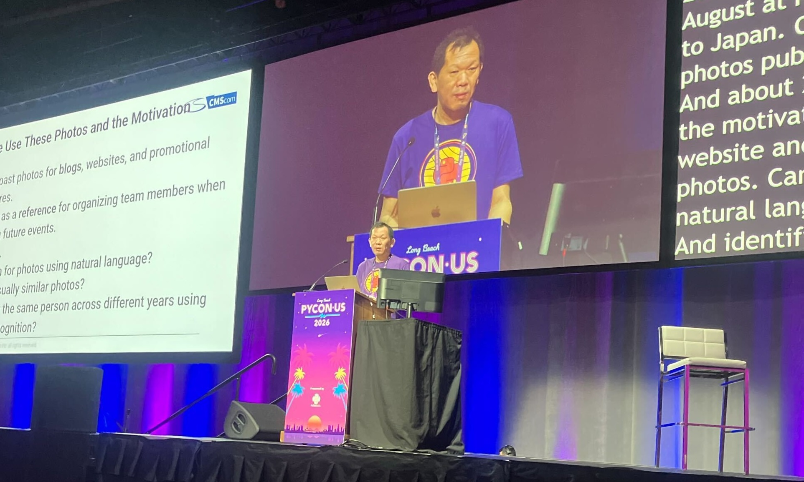

# Day 2

````{admonition} コラム：(terapyon LTコラム)
このコラムはPython Asia Organizationの寺田（[@terapyon](https://x.com/terapyon)）がお届けします。

私はPyCon USに参加すると、コミュニティーブースの運営や各国のコミュニティーメンバーとの交流を中心に活動しています。そのため、発表する側よりも聞く側になることが多いのですが、今年はLightning Talk（LT）で登壇する機会を得ました。

PyCon USでは会期中にLTが複数回あり、1枠5分ながら毎年人気です。
当初は参加者の多いDay 1夕方のLT枠を狙っていましたが、ブース対応中に締切を過ぎて応募できませんでした。
そこで翌朝の募集に応募し、Day 2朝のLTで2番手として登壇しました。私のLTの開始は朝8:05でした。

私は海外カンファレンスでLTをした経験はありますが、PyCon USでのLTは今回で2回目です。また、これまでのLTはコミュニティー活動やイベント運営に関する話題が多く、技術的な内容を中心に発表する機会はそれほど多くありませんでした。

今回紹介したのは、最近取り組んでいる画像検索の仕組みです。

「[Searching 23,000 Photos with Modern VLMs: From Text to Image](https://speakerdeck.com/terapyon/searching-23000-photos-with-modern-vlms-from-text-to-image)」と題し、PyCon JPの過去の写真をセマンティック検索する仕組みを紹介しました。

5分間という制約もあるため、アルゴリズムの詳細や評価結果については触れず、「どのようなことができるのか」を中心に紹介しました。特に、実際に動作するデモを見せることを重視して準備を進めました。

ただ、発表では時間配分をミスして、最後まで話すことができませんでした。



LTはたった5分ですが、限られた時間の中で何を伝えるかを整理することの難しさを改めて感じました。
一方で、デモは問題なく動作しました。会場からも反応があり、想定していたポイントで笑いや驚きの声が上がったのは嬉しかったです。

発表後には何人かの参加者から反響を聞けました。
「同じようなものを作ってみたい」
「どうやって実装しているのか興味がある」
自分が取り組んでいる内容に興味を持ってもらえたことは素直に嬉しかったです。

PyCon USには世界中から参加者が集まります。英語で発表することには毎回緊張しますが、自分が作ったものを直接紹介し、その場で反応を得られることは貴重な経験です。

今後もコミュニティー活動だけでなく技術的な取り組みについても発信していきたいと思います。
````


## Member Lunch

* Grantの期間はみじかくなった
* 金額はAfricaが多いなぁ
* 質疑応答
* 寺田さんと吉田さんの質問

````{admonition} コラム：(yoshida MemberLunchについて書かない?)
ここにコラムを書いてね
````

## Tachyon: Python 3.15's sampling profiler is faster than your code - PyCon US 2026

* https://us.pycon.org/2026/schedule/presentation/31/
* python -m profile.sampling
* capture mode

```
python -m profile.sampling run main.py
python -m profile.sampling attach <pid>
```

reporters

* visualizeされる
* 最初に見るのは --pstats

what;s happening now?

* フレームグラフがカラーで見れる

* --heatmap
* --diff-framegraph →パフォーマンスが上昇したか見れる
* --gecko: Firefoxのprofilerを使える
* あとでanalyzeする: --binary

````{admonition} コラム：(koxudaxiコラムタイトル)
ここにコラムを書いてね
````

## mypyc?

## PyLadis Auction


