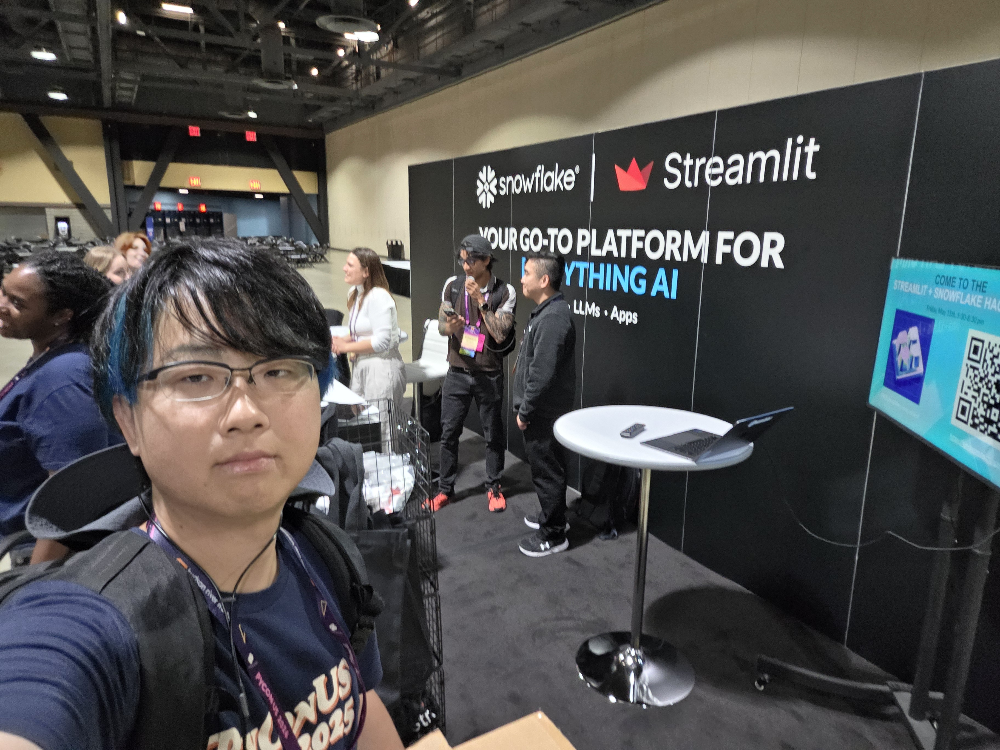
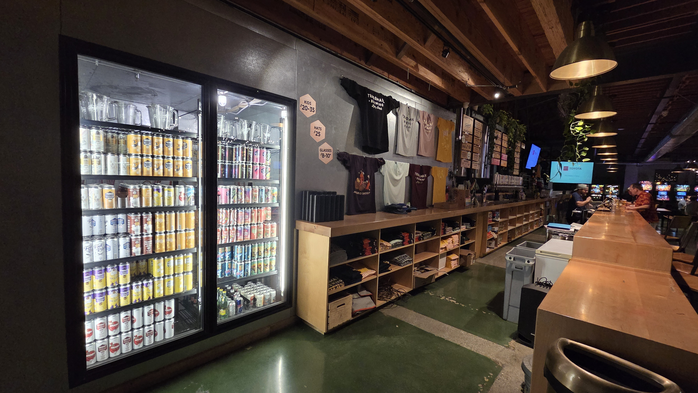
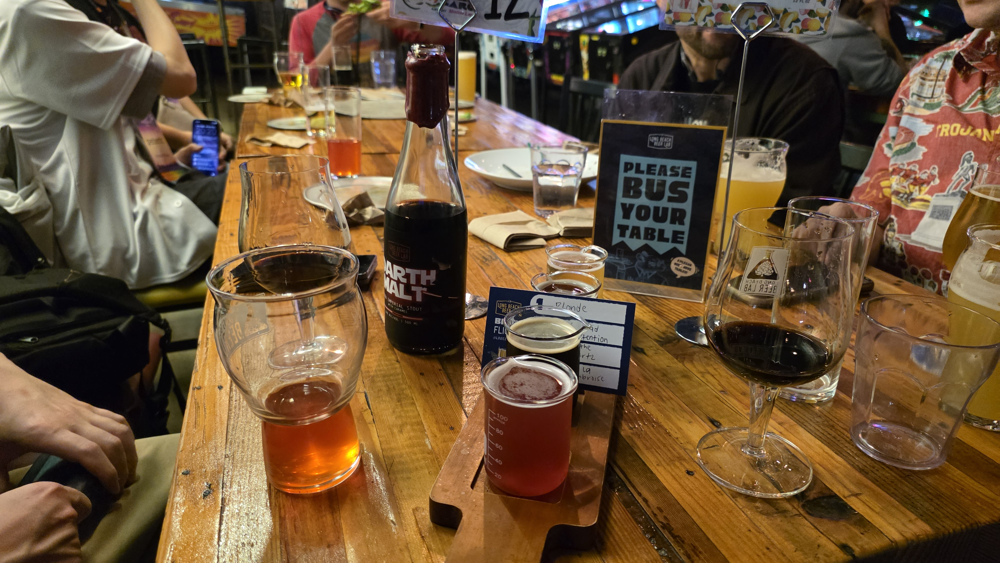
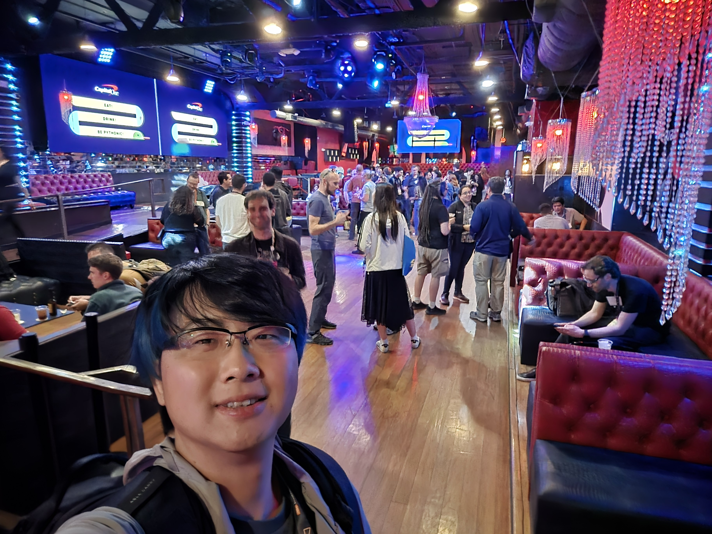
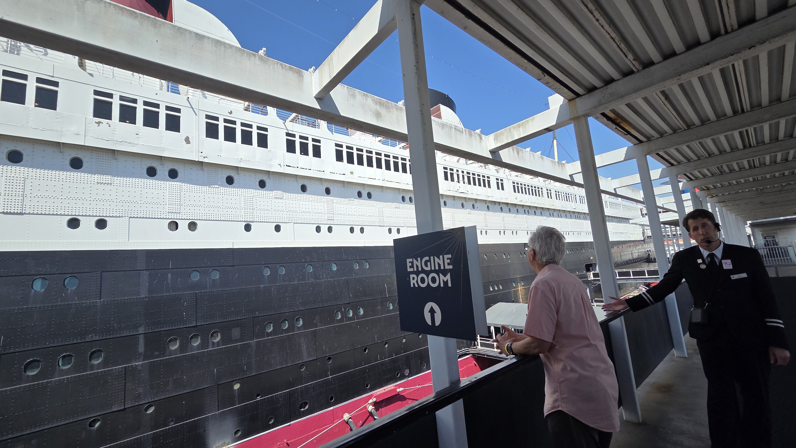
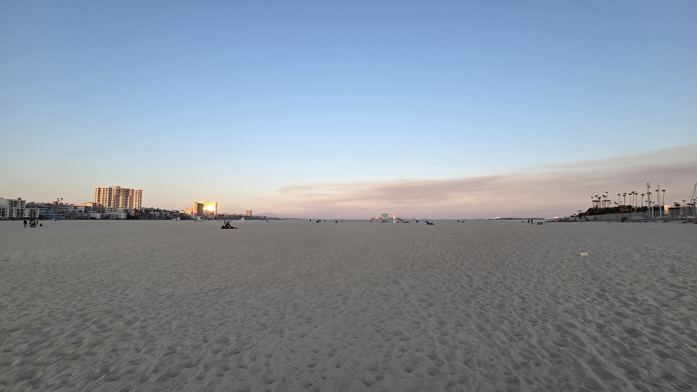

# Day 3

## ポスターセッション、ジョブフェア

````{admonition} コラム：肩の力を抜いて楽しむPyCon US
橘祐一郎（[@whitphx](https://github.com/whitphx/)）です。
PyCon US 2025に続き、今年も参加してきました。

今回の私は、発表者でもブース出展者でもなく、仕事として参加したわけでもありません。ただの一参加者としてロングビーチまで行きました。
単純に去年参加したPyCon USが楽しかったのと、それに加えて今年はロングビーチにも行ってみたかった程度の理由で、あまり気負わずに参加しました。

私は基本的に、海外のPyConにはトークが採択されたら行くようにしていました。飛行機代もホテル代も安くないので、せっかく行くならできれば発表して目立ちたいからです。
とはいえPyCon USは競争率が高く、「登壇できたら行く」と考えているといつまでも行く機会がないかと思い、去年から発表にこだわらず普通に参加者として行くことにしました。
去年はそれでも[Summitに出てみたり](https://gihyo.jp/article/2025/06/pycon-us-2025-01#ghbrRbSLSI)してそれなりに頑張っていましたが、今年は肩の力を抜いて特に気張るイベントを作らずに参加してみました。実際、それで十分楽しかったです。

想像通り、基本的にはセッションを聞いたり、キーノートやライトニングトークを眺めたり、ブースを回ったりして過ごしました。会場を歩いているだけでも知り合いに会いますし、ブースや飲み会で初対面の人と盛り上がることもあります。



カンファレンス前日の夜には、会場近くのバーで日本から来ていた参加者たちと飲んでいたところ、PyCon USのバッジをつけた初対面の参加者と自然に同じテーブルを囲むことになりました。特に準備していなくても、同じイベントに来ている人同士で話が弾みます。
Python Asiaが音頭をとった飲み会に参加した時は、アジア各地から来た参加者が集まっていて、「また別の国のPyConで会いましょう」という話にもなりました。実際どこかのPyConに行くとよく会いますし、今回初めて知り合えた人もいて、輪が広がっている感じがします。




3日目は会場を抜け出して現地の友人と映画を観に行きました。ホテル代や参加費の元を取ろうと気負いすぎなくてもよいのだと思います。

スプリントでは、今年は特定のプロジェクトのテーブルには入らず、会場を仕事場のように使いながら自分のタスクを進めたり、近くに来た人と話したりしていました。
これも[去年](https://gihyo.jp/article/2025/06/pycon-us-2025-03#gh3794ZQjQ)とは大きな違いです。
スプリント2日目には、ランチに行くグループに混ぜてもらってタコスを食べた流れで、そのままロングビーチの観光地（クイーンメアリー号）を見に行き、夕方には海岸を散歩し、そのまま食事と飲みに行ってしまいました。



こんな感じで、意識の低い参加の仕方をしてみました。十分に楽しめましたし、それもアリではないかと思います、ということでこのコラムを締めたいと思います。
````
